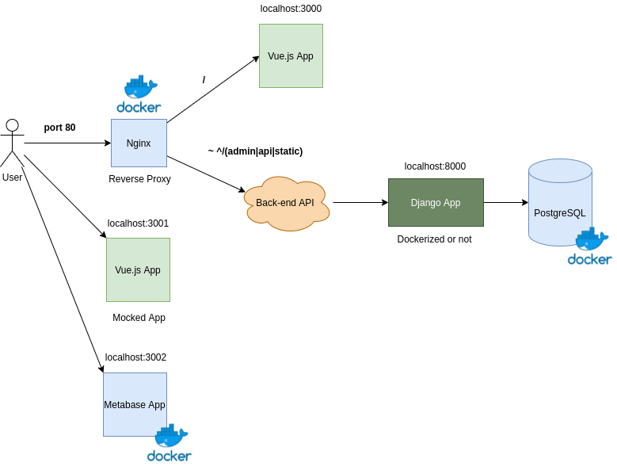

# {{name}}

## {{description}}

# F-Square cycle development

1. Implement your features on localhost:3001 (API Mock)
2. Validate than with a stakeholder (go back one step if needed)
3. Use TDD to develop the back-end API for the feature
4. Check if everything is okay on the actual front-end on localhost:3000 (go back one step if needed)
5. Push your changes! \o/

# Design System

  

